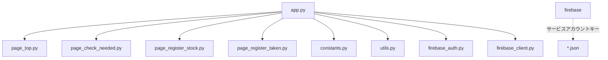

# ファイル構成と関係性

- `app.py` : アプリのエントリーポイント。画面遷移や全体の状態管理を行う。
- `page_top.py` : TOP画面。アプリの概要や案内を表示。
- `page_check_needed.py` : 翌日持っていくべき着替えの枚数を表示。
- `page_register_stock.py` : 保育園にある着替えの枚数を登録。
- `page_register_taken.py` : 持ち帰ってきた着替えを登録。
- `constants.py` : 着替え種別などの定数を管理。
- `utils.py` : 共通の計算・リセット処理などを管理。
- `firebase_auth.py` : Firebase認証処理。
- `firebase_client.py` : Firestore連携。
- `.gitignore` : 機密情報や不要ファイルの除外設定。

### ファイル関係図（Mermaid）



## セットアップ
1. 必要なパッケージのインストール
   ```bash
   pip install -r requirements.txt
   ```
2. Firebaseサービスアカウントキー（JSON）をプロジェクト直下に配置し、`.gitignore`で除外
3. `app.py` を実行
   ```bash
   streamlit run app.py
   ```

## 注意
- サービスアカウントキー（JSON）は絶対に公開しないでください。
- Firestore連携は `firebase_sample.py` を参考にしてください。
# 保育園 着替え管理アプリ

このアプリは、保育園に持っていく子どもの着替え（肌着・上着・ズボンなど）の在庫管理や、持ち込み・持ち帰りの記録を簡単に行うためのWebアプリです。  
**スマートフォンからも使いやすいUI**で、毎日の着替え準備をサポートします。

---

## 主な機能

- 現在の保育園の着替え在庫数の表示
- 今日持っていく・持ち帰る着替え枚数の記録
- 翌日持っていくべき着替え枚数の自動計算
- 在庫の初期化
- **Firebase認証によるログイン機能（登録ユーザーのみ利用可能）**

---

## Firebaseについて

- プロジェクト名: **yui-stock**
- FirebaseコンソールURL: [https://console.firebase.google.com/project/yui-stock](https://console.firebase.google.com/project/yui-stock)

このアプリを利用するには、**Firebase Authentication（メールアドレス＋パスワード）でのログインが必要です**。

---

## Firebaseユーザー登録方法（管理者向け）

1. [Firebaseコンソール](https://console.firebase.google.com/project/yui-stock) にアクセス
2. 左メニュー「Authentication」→「ユーザー」
3. 「ユーザーを追加」ボタンをクリック
4. 利用者のメールアドレスとパスワードを入力して登録
5. 登録したメールアドレス・パスワードを利用者に伝えてください

※ 一般利用者が自分で新規登録する機能はありません。管理者がFirebaseコンソールから登録してください。

---

## 必要な環境

- Python 3.13.5
- Streamlit

---

## セットアップ手順

1. 必要なパッケージのインストール

   ```bash
   pip install -r requirements.txt
   ```

2. アプリの起動

   ```bash
   streamlit run app.py
   ```

3. ブラウザで表示されるURLにアクセスしてください。

---

## ファイル構成

- `app.py` : Streamlitによるメインアプリケーション
- `page_top.py` : TOP画面
- `page_check_needed.py` : 翌日持っていくべき着替えの枚数を表示
- `page_register_stock.py` : 保育園にある着替えの枚数を登録
- `page_register_taken.py` : 持ち帰ってきた着替えを登録
- `constants.py` : 着替え種別などの定数
- `utils.py` : 共通の計算・リセット処理
- `firebase_auth.py` : Firebase認証処理
- `firebase_client.py` : Firestore連携
- `requirements.txt` : 必要なPythonパッケージ一覧

---

## 注意事項

- データはFirebase Firestoreに保存されます。
- サービスアカウントキー（JSON）は絶対に公開しないでください。
- 本アプリは登録ユーザーのみ利用可能です。

---

## ライセンス

MIT
